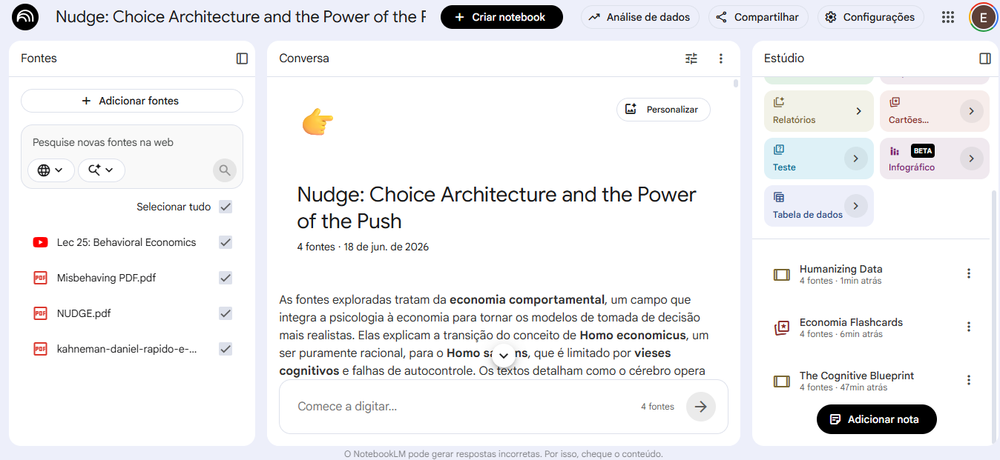
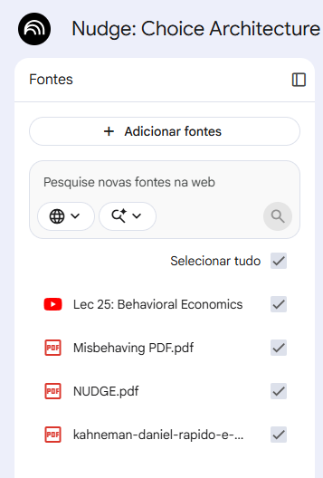
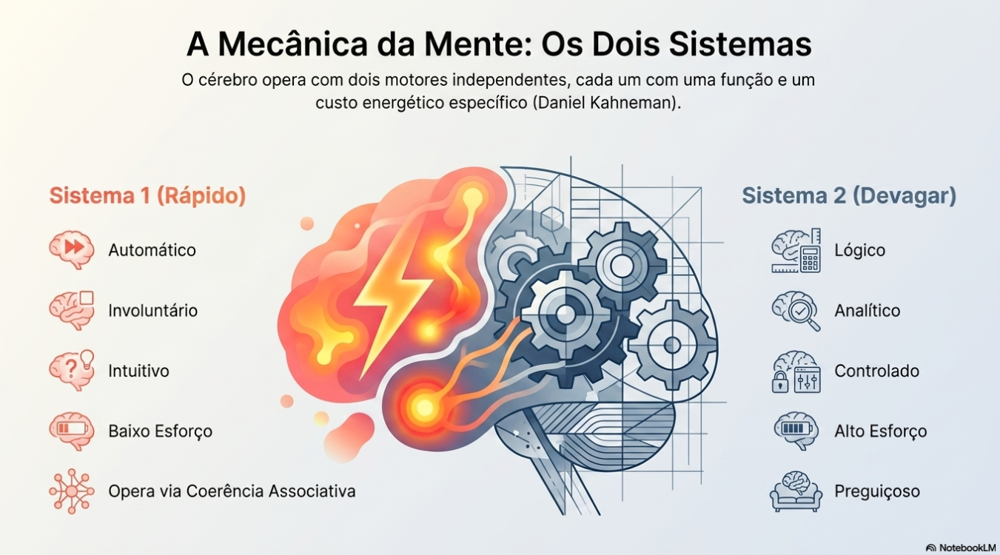
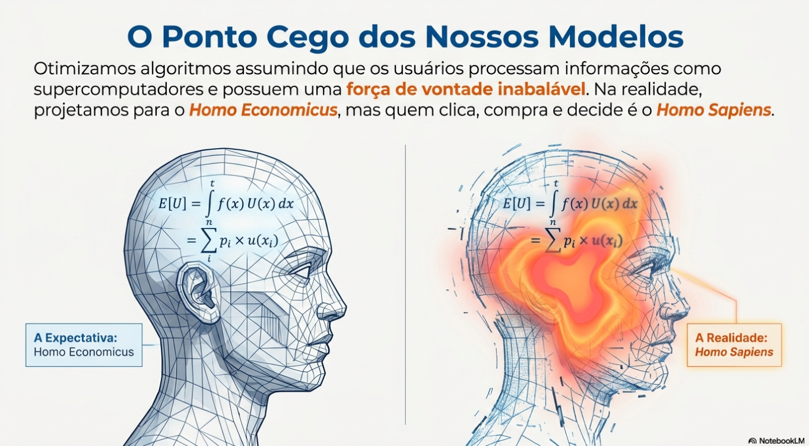

# behavioral-economics-notebooklm

# Caderno Temático no NotebookLM: Economia Comportamental para Analistas de Dados

## Visão Geral do NotebookLM

## Descrição do Projeto

Este projeto foi desenvolvido como parte do desafio prático do Bradesco - GenAI & Dados em parceria com a DIO, com o objetivo de colocar em prática o conhecimento adquirido e explorar o NotebookLM como ferramenta de aprendizagem ativa.

Para a construção do caderno temático, foi escolhido o tema **Economia Comportamental aplicada à Análise de Dados**, buscando compreender como fatores psicológicos e comportamentais podem auxiliar na interpretação de padrões observados em analises de dados.

Durante o desenvolvimento do projeto foram realizadas atividades de curadoria de fontes, engenharia de prompts e consolidação do conhecimento em um material estruturado para estudos e futuras revisões.

---

# Objetivos do Caderno Temático

* Explorar o NotebookLM como ferramenta de estudo e organização do conhecimento.
* Compreender os fundamentos da Economia Comportamental.
* Estudar os principais vieses cognitivos e mecanismos de tomada de decisão.
* Investigar como conceitos comportamentais podem auxiliar na interpretação de comportamentos observados em dados.
* Praticar técnicas de engenharia de prompts para obtenção de respostas mais relevantes.
* Consolidar os aprendizados em um miniguia de estudos reutilizável.

---

# Curadoria de Fontes

## Fontes Utilizadas

As seguintes fontes foram utilizadas como base para o caderno temático no NotebookLM:

## Livros

1. Rápido e Devagar — Daniel Kahneman
2. Nudge — Richard Thaler e Cass Sunstein
3. Possivelmente Irracional — Dan Ariely
4. Misbehaving — Richard Thaler

## Vídeo

5. Aula 25: Economia Comportamental — MIT OpenCourseWare

### Critério de Seleção

As fontes foram escolhidas por apresentarem diferentes perspectivas da Economia Comportamental, incluindo fundamentos teóricos, pesquisas experimentais, aplicações práticas e a evolução histórica da área.

---

# Engenharia de Prompts

## Prompt Principal

O principal prompt utilizado no NotebookLM foi:

> Adote a persona de um Behavioral Scientist.
>
> Contexto:
>
> Estou estudando Análise de Dados e Business Intelligence e desejo utilizar a Economia Comportamental como uma ferramenta complementar para compreender os comportamentos humanos para analises mais profundas e insights estratégicos.
>
> Guardrails:
>
> Utilize apenas as fontes fornecidas ao NotebookLM evitando conteúdos prejudiciais, irrelevantes ou incorretos.
>
> Objetivo:
>
> Criar um material didático completo sobre Economia Comportamental voltado para um Analista de Dados iniciante.
>
> Estruture o material da seguinte forma:
>
> * Introdução
> * Fundamentos
> * Principais Conceitos
> * Aplicações para Análise de Dados
> * Estudos de Caso

---

## Prompts Complementares

### Prompt 1

Quais conceitos da Economia Comportamental possuem maior potencial de aplicação em People Analytics?

### Prompt 2

Quais vieses cognitivos podem explicar comportamentos observados em clientes e usuários?

### Prompt 3

Transforme o conteúdo estudado em um conjunto de flashcards para revisão rápida.

### Prompt 4

Crie exemplos de hipóteses comportamentais que podem ser investigadas a partir de dados de clientes, colaboradores e usuários.

---

# Cicatrizes e Aprendizados

## Desafio 1

O Objetivo deve ser claro e acompanhar o contexto

### Solução

Foi necessario um refinamento no contexto para aplicação em Análise de Dados para tornar o conteúdo mais aplicavél.

---

## Desafio 2

Os conceitos eram apresentados sem conexão clara com cenários reais.

### Solução

Foram solicitados estudos de caso envolvendo E-commerce, People Analytics, Educação e Produtos Digitais.

---

## Desafio 3

As respostas descreviam os conceitos, mas não mostravam como utilizá-los durante uma análise.

### Solução

Foi solicitado que cada conceito incluísse exemplos aplicados à interpretação de dados e formulação de hipóteses.

---

# Miniguia de Estudo

## O que é Economia Comportamental?

A Economia Comportamental é uma área que combina conceitos da Economia e da Psicologia para compreender como as pessoas realmente tomam decisões, considerando emoções, limitações cognitivas e vieses comportamentais.

---

## Sistemas de Pensamento

### Sistema 1

* Rápido
* Intuitivo
* Automático
* Baseado em atalhos mentais

### Sistema 2

* Lento
* Analítico
* Deliberado
* Baseado em raciocínio consciente

---

## Principais Conceitos

### Heurísticas

Atalhos mentais utilizados para simplificar decisões.

### Ancoragem

Tendência de utilizar a primeira informação recebida como referência para decisões futuras.

### Viés de Confirmação

Tendência de buscar informações que reforcem crenças já existentes.

### Aversão à Perda

Perdas tendem a gerar impactos emocionais maiores do que ganhos equivalentes.

### Nudge

Pequenas mudanças no ambiente que influenciam decisões sem restringir opções.

### Contabilidade Mental

Forma como as pessoas categorizam recursos e decisões financeiras em suas mentes.

---

## Aplicações para Análise de Dados

A Economia Comportamental pode auxiliar analistas a:

* Formular hipóteses sobre comportamentos observados em dados.
* Interpretar padrões de retenção, engajamento e abandono.
* Compreender possíveis motivações por trás de decisões de clientes e colaboradores.
* Gerar insights mais profundos para apoiar decisões de negócio.

---

## Exemplos de Aplicação

### E-commerce

Comportamento observado:

Alta taxa de abandono de carrinho.

Possível hipótese comportamental:

Aversão à perda ou excesso de opções durante a compra.

---

### People Analytics

Comportamento observado:

Aumento do turnover.

Possível hipótese comportamental:

Percepção de falta de reconhecimento ou comparação social.

---

### Produtos Digitais

Comportamento observado:

Baixa utilização de determinada funcionalidade.

Possível hipótese comportamental:

Falta de incentivo imediato ou excesso de complexidade.

---

# Glossário

| Termo                   | Definição                                        |
| ----------------------- | ------------------------------------------------ |
| Economia Comportamental | Estudo da tomada de decisão humana               |
| Heurística              | Atalho mental utilizado para decidir rapidamente |
| Viés Cognitivo          | Tendência sistemática de julgamento              |
| Sistema 1               | Pensamento rápido e intuitivo                    |
| Sistema 2               | Pensamento lento e analítico                     |
| Ancoragem               | Influência da primeira informação recebida       |
| Aversão à Perda         | Tendência de valorizar mais perdas do que ganhos |
| Nudge                   | Arquitetura de escolha que influencia decisões   |

---

# Biblioteca de Prompts Reutilizáveis:

## Revisão de Conteúdo

Resuma este tema em 10 tópicos essenciais.

## Aplicação em Dados

Como este conceito pode ajudar um analista a interpretar comportamentos observados nos dados?

## Formulação de Hipóteses

Quais hipóteses comportamentais podem explicar este padrão observado nos dados?

## Estudos de Caso

Crie um estudo de caso aplicando este conceito em um contexto empresarial.

## Revisão para Entrevistas

Como eu explicaria este conceito para um recrutador da área de Dados?

---
# Materiais Gerados:

## Resumo em Áudio (Podcast)

Áudio gerado pelo NotebookLM a partir das fontes utilizadas neste estudo.

[Ouvir ou baixar o áudio](https://drive.google.com/file/d/1ASVTe67rxHq_VVt8tUpiVmlkb96etm5Q/view?usp=sharing) 

## Infográfico - Princípios da Economia Comportamental

 

## Slides da Apresentação Gerada (Disponível abaixo para download)

 ## Apresentação em PowerPoint 

[Baixar apresentação](docs/Humanizing_Data.pptx)

# Conclusão

O NotebookLM demonstrou ser uma ferramenta efiente para organização do conhecimento, curadoria de informações e construção de materiais de estudo. Através deste caderno temático foi possível aprofundar o entendimento sobre Economia Comportamental e explorar formas de relacionar seus conceitos com a interpretação de comportamentos observados em análises de dados.

